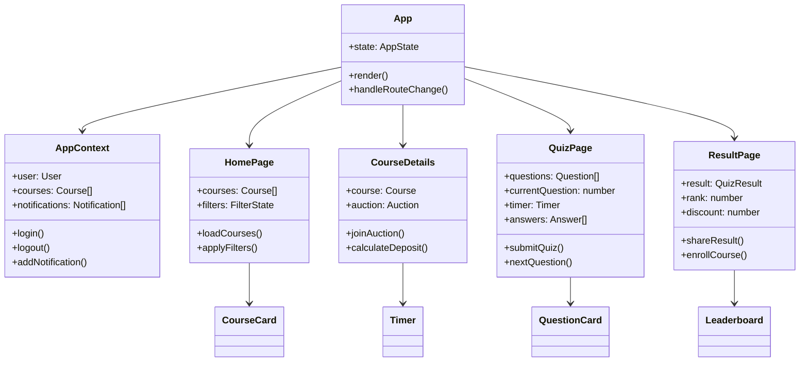
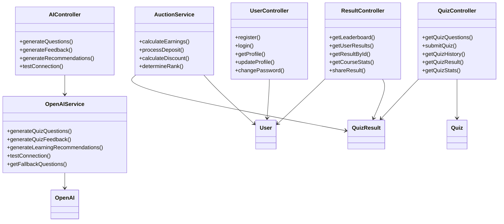
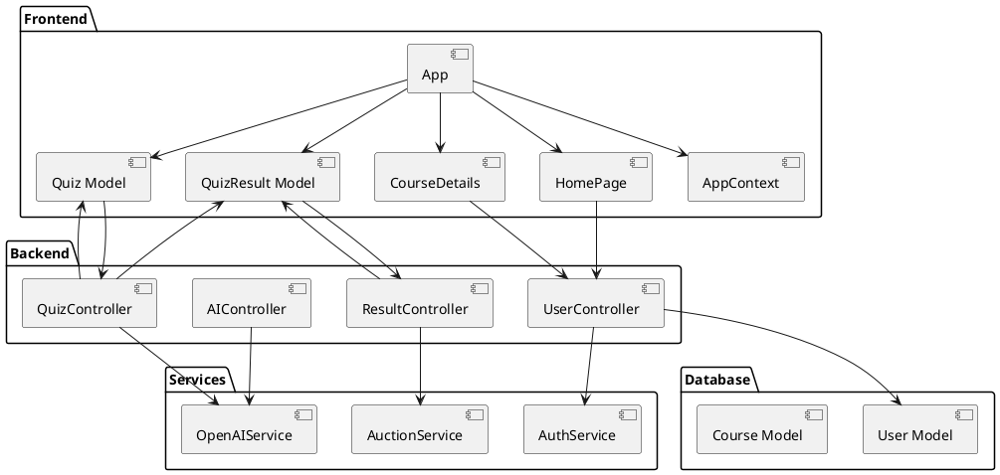
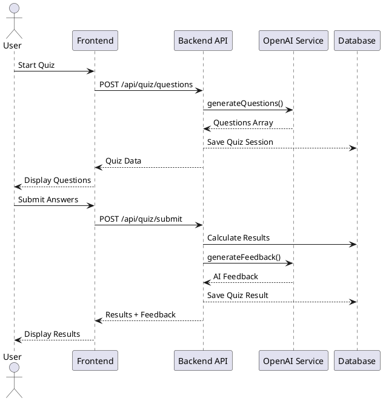

# Class Diagrams for Knowledge Auction Platform

This document contains various diagram formats used to generate classes and understand the system architecture.

## 📋 Table of Contents
- [Mermaid Class Diagrams](#mermaid-class-diagrams)
- [PlantUML Diagrams](#plantuml-diagrams)
- [ASCII Art Diagrams](#ascii-art-diagrams)
- [JSON Schema Definitions](#json-schema-definitions)
- [TypeScript Interface Templates](#typescript-interface-templates)

---

## 🎨 Mermaid Class Diagrams

### Frontend Component Architecture



### Backend Service Architecture



### Database Models

```mermaid
classDiagram
    class User {
        +String: id
        +String: name
        +String: email
        +String: password
        +String: role
        +Object: stats
        +Array: achievements
        +Object: preferences
        +comparePassword()
        +updateLoginStreak()
        +addAchievement()
    }
    
    class Course {
        +String: id
        +String: title
        +String: description
        +Number: price
        +String: instructor
        +Array: topics
        +Array: prerequisites
        +Object: auction
    }
    
    class Quiz {
        +String: id
        +String: courseId
        +String: title
        +Array: questions
        +Object: settings
        +Object: stats
        +Boolean: isPublished
        +getQuizForUser()
    }
    
    class QuizResult {
        +String: id
        +String: userId
        +String: quizId
        +Number: score
        +Number: rank
        +Array: answers
        +Number: earnings
        +Date: createdAt
    }
    
    class Question {
        +String: id
        +String: text
        +String: type
        +Array: options
        +Number: correctAnswer
        +String: explanation
        +Number: difficulty
        +Number: points
    }
    
    User ||--o{ QuizResult : takes
    Course ||--o{ Quiz : contains
    Quiz ||--o{ Question : has
    Quiz ||--o{ QuizResult : generates
```

---

## 🌿 PlantUML Diagrams

### Component Interaction



### Data Flow Diagram



---

## 📝 ASCII Art Diagrams

### System Architecture Overview

```
┌─────────────────────────────────────────────────────────────┐
│                    FRONTEND (React)                        │
├─────────────────────────────────────────────────────────────┤
│  ┌─────────────┐ ┌─────────────┐ ┌─────────────┐ ┌─────────┐ │
│  │    App      │ │ HomePage    │ │ QuizPage    │ │ Result  │ │
│  │ Component   │ │ Component   │ │ Component   │ │ Page    │ │
│  └─────────────┘ └─────────────┘ └─────────────┘ └─────────┘ │
│         │               │               │             │      │
│  ┌─────────────┐ ┌─────────────┐ ┌─────────────┐ ┌─────────┐ │
│  │ AppContext  │ │ CourseCard  │ │ QuestionCard│ │Leader-  │ │
│  │ (Global)    │ │ Component   │ │ Component   │ │board    │ │
│  └─────────────┘ └─────────────┘ └─────────────┘ └─────────┘ │
└─────────────────────────────────────────────────────────────┘
                              │
                              ▼ HTTP/REST API
┌─────────────────────────────────────────────────────────────┐
│                    BACKEND (Node.js)                       │
├─────────────────────────────────────────────────────────────┤
│  ┌─────────────┐ ┌─────────────┐ ┌─────────────┐ ┌─────────┐ │
│  │   Express   │ │ Controllers │ │  Services   │ │Middle-  │ │
│  │   Server    │ │             │ │             │ │ware     │ │
│  └─────────────┘ └─────────────┘ └─────────────┘ └─────────┘ │
│         │               │               │             │      │
│  ┌─────────────┐ ┌─────────────┐ ┌─────────────┐ ┌─────────┐ │
│  │   Routes    │ │   Models    │ │ OpenAI API  │ │Auth/JWT │ │
│  │             │ │ (Mongoose)  │ │ Integration │ │         │ │
│  └─────────────┘ └─────────────┘ └─────────────┘ └─────────┘ │
└─────────────────────────────────────────────────────────────┘
                              │
                              ▼
┌─────────────────────────────────────────────────────────────┐
│                    DATABASE (MongoDB)                       │
├─────────────────────────────────────────────────────────────┤
│  ┌─────────────┐ ┌─────────────┐ ┌─────────────┐ ┌─────────┐ │
│  │    Users    │ │   Courses   │ │    Quiz     │ │Results  │ │
│  │ Collection  │ │ Collection  │ │ Collection  │ │Collection│ │
│  └─────────────┘ └─────────────┘ └─────────────┘ └─────────┘ │
└─────────────────────────────────────────────────────────────┘
```

### Class Hierarchy

```
BaseComponent (React)
├── App
├── Pages
│   ├── HomePage
│   ├── CourseDetails
│   ├── QuizPage
│   ├── ResultPage
│   ├── Leaderboard
│   ├── Login
│   └── Signup
├── Components
│   ├── Navbar
│   ├── CourseCard
│   ├── QuestionCard
│   ├── Timer
│   ├── Loader
│   ├── Notification
│   └── ProtectedRoute
└── Hooks
    ├── useAuth
    ├── useTimer
    └── useApi

Model (Mongoose)
├── User
│   ├── Authentication
│   ├── Profile Management
│   ├── Statistics Tracking
│   └── Achievement System
├── Course
│   ├── Basic Information
│   ├── Auction Settings
│   └── Content Structure
├── Quiz
│   ├── Question Management
│   ├── Settings Configuration
│   └── Statistics Tracking
├── QuizResult
│   ├── Score Calculation
│   ├── Ranking System
│   └── Earnings Calculation
└── Question
    ├── Multiple Choice
    ├── Answer Validation
    └── Explanation System
```

---

## 📋 JSON Schema Definitions

### User Model Schema

```json
{
  "$schema": "http://json-schema.org/draft-07/schema#",
  "title": "User",
  "type": "object",
  "properties": {
    "id": {
      "type": "string",
      "description": "Unique user identifier"
    },
    "name": {
      "type": "string",
      "minLength": 1,
      "maxLength": 50,
      "description": "User's full name"
    },
    "email": {
      "type": "string",
      "format": "email",
      "description": "User's email address"
    },
    "password": {
      "type": "string",
      "minLength": 6,
      "description": "Hashed password"
    },
    "role": {
      "type": "string",
      "enum": ["student", "instructor", "admin"],
      "default": "student"
    },
    "stats": {
      "type": "object",
      "properties": {
        "totalQuizzesTaken": {"type": "number", "minimum": 0},
        "totalScore": {"type": "number", "minimum": 0},
        "averageScore": {"type": "number", "minimum": 0, "maximum": 100},
        "totalEarnings": {"type": "number", "minimum": 0},
        "highestScore": {"type": "number", "minimum": 0, "maximum": 100},
        "correctAnswers": {"type": "number", "minimum": 0},
        "totalAnswers": {"type": "number", "minimum": 0}
      }
    },
    "achievements": {
      "type": "array",
      "items": {
        "type": "object",
        "properties": {
          "type": {"type": "string"},
          "earnedAt": {"type": "string", "format": "date-time"},
          "metadata": {"type": "object"}
        }
      }
    }
  },
  "required": ["name", "email", "password"]
}
```

### Quiz Model Schema

```json
{
  "$schema": "http://json-schema.org/draft-07/schema#",
  "title": "Quiz",
  "type": "object",
  "properties": {
    "id": {
      "type": "string",
      "description": "Unique quiz identifier"
    },
    "courseId": {
      "type": "string",
      "description": "Associated course ID"
    },
    "title": {
      "type": "string",
      "description": "Quiz title"
    },
    "description": {
      "type": "string",
      "description": "Quiz description"
    },
    "questions": {
      "type": "array",
      "items": {
        "$ref": "#/definitions/Question"
      }
    },
    "settings": {
      "type": "object",
      "properties": {
        "timeLimit": {"type": "number", "minimum": 0},
        "passingScore": {"type": "number", "minimum": 0, "maximum": 100},
        "allowReview": {"type": "boolean"},
        "showCorrectAnswers": {"type": "boolean"}
      }
    },
    "stats": {
      "type": "object",
      "properties": {
        "totalAttempts": {"type": "number", "minimum": 0},
        "averageScore": {"type": "number", "minimum": 0, "maximum": 100},
        "highestScore": {"type": "number", "minimum": 0, "maximum": 100}
      }
    }
  },
  "required": ["courseId", "title", "questions"],
  "definitions": {
    "Question": {
      "type": "object",
      "properties": {
        "id": {"type": "string"},
        "text": {"type": "string"},
        "type": {"type": "string", "enum": ["multiple-choice"]},
        "options": {
          "type": "array",
          "items": {"type": "string"},
          "minItems": 2,
          "maxItems": 6
        },
        "correctAnswer": {"type": "number", "minimum": 0},
        "explanation": {"type": "string"},
        "difficulty": {"type": "number", "minimum": 1, "maximum": 5},
        "points": {"type": "number", "minimum": 1},
        "category": {"type": "string"}
      },
      "required": ["text", "options", "correctAnswer"]
    }
  }
}
```

---

## 🔧 TypeScript Interface Templates

### Frontend Component Interfaces

```typescript
// Base Component Props
interface BaseComponentProps {
  className?: string;
  children?: React.ReactNode;
}

// User Interfaces
interface User {
  id: string;
  name: string;
  email: string;
  role: 'student' | 'instructor' | 'admin';
  avatar?: string;
  stats: UserStats;
  achievements: Achievement[];
  preferences: UserPreferences;
}

interface UserStats {
  totalQuizzesTaken: number;
  totalScore: number;
  averageScore: number;
  totalEarnings: number;
  highestScore: number;
  correctAnswers: number;
  totalAnswers: number;
  accuracy: number; // calculated
}

interface Achievement {
  type: string;
  earnedAt: Date;
  metadata: Record<string, any>;
}

// Course Interfaces
interface Course {
  id: string;
  title: string;
  description: string;
  instructor: string;
  price: number;
  originalPrice: number;
  duration: string;
  level: 'beginner' | 'intermediate' | 'advanced';
  category: string;
  enrolledCount: number;
  rating: number;
  reviewCount: number;
  topics: string[];
  prerequisites: string[];
  auction: AuctionSettings;
}

interface AuctionSettings {
  isActive: boolean;
  startTime: Date;
  endTime: Date;
  depositRate: number;
  participantCount: number;
  maxParticipants: number;
}

// Quiz Interfaces
interface Quiz {
  id: string;
  courseId: string;
  title: string;
  description: string;
  questions: Question[];
  settings: QuizSettings;
  stats: QuizStats;
  isPublished: boolean;
  isActive: boolean;
}

interface Question {
  id: string;
  text: string;
  type: 'multiple-choice';
  options: string[];
  correctAnswer: number;
  explanation: string;
  difficulty: number;
  points: number;
  category: string;
}

interface QuizSettings {
  timeLimit: number;
  passingScore: number;
  allowReview: boolean;
  showCorrectAnswers: boolean;
}

// Result Interfaces
interface QuizResult {
  id: string;
  userId: string;
  quizId: string;
  courseId: string;
  courseTitle: string;
  quizTitle: string;
  score: number;
  correctAnswers: number;
  totalQuestions: number;
  timeSpent: number;
  rank: number;
  totalParticipants: number;
  earnings: number;
  passed: boolean;
  answers: Answer[];
  createdAt: Date;
}

interface Answer {
  questionId: string;
  questionText: string;
  userAnswer: number;
  correctAnswer: number;
  isCorrect: boolean;
  options: string[];
  explanation: string;
  points: number;
  timeSpent: number;
}

// App Context Interface
interface AppContextType {
  user: User | null;
  courses: Course[];
  notifications: Notification[];
  loading: boolean;
  login: (email: string, password: string) => Promise<void>;
  logout: () => void;
  register: (userData: RegisterData) => Promise<void>;
  addNotification: (notification: Notification) => void;
  clearNotifications: () => void;
}

// API Response Interfaces
interface ApiResponse<T> {
  success: boolean;
  message: string;
  data: T;
}

interface PaginatedResponse<T> {
  success: boolean;
  data: {
    results: T[];
    pagination: {
      page: number;
      limit: number;
      total: number;
      pages: number;
    };
  };
}
```

### Backend Service Interfaces

```typescript
// Service Interfaces
interface IAuthService {
  register(userData: RegisterData): Promise<AuthResponse>;
  login(credentials: LoginCredentials): Promise<AuthResponse>;
  verifyToken(token: string): Promise<User>;
  changePassword(userId: string, oldPassword: string, newPassword: string): Promise<void>;
}

interface IQuizService {
  getQuizQuestions(courseId: string): Promise<QuizData>;
  submitQuiz(quizSubmission: QuizSubmission): Promise<QuizResult>;
  getQuizHistory(userId: string, pagination: PaginationOptions): Promise<PaginatedResponse<QuizResult>>;
  getQuizResult(resultId: string): Promise<QuizResult>;
  getQuizStats(courseId: string): Promise<QuizStats>;
}

interface IAIService {
  generateQuestions(params: QuestionGenerationParams): Promise<Question[]>;
  generateFeedback(quizResult: QuizResult): Promise<AIFeedback>;
  generateRecommendations(params: RecommendationParams): Promise<LearningRecommendations>;
  testConnection(): Promise<boolean>;
}

interface IAuctionService {
  calculateEarnings(result: QuizResult): Promise<number>;
  processDeposit(userId: string, amount: number): Promise<Transaction>;
  calculateDiscount(rank: number, totalParticipants: number): Promise<number>;
  determineRank(score: number, allResults: QuizResult[]): Promise<number>;
}

// Controller Interfaces
interface IController {
  // Common controller methods
  handleRequest(req: Request, res: Response, next: NextFunction): Promise<void>;
  handleError(error: Error, req: Request, res: Response): void;
}

// Middleware Interfaces
interface IAuthMiddleware {
  authenticateToken(req: Request, res: Response, next: NextFunction): Promise<void>;
  optionalAuth(req: Request, res: Response, next: NextFunction): Promise<void>;
  requireAdmin(req: Request, res: Response, next: NextFunction): void;
  requireInstructor(req: Request, res: Response, next: NextFunction): void;
}

// Database Interfaces
interface IUserModel extends Model<User> {
  findByEmailForAuth(email: string): Promise<User | null>;
  getLeaderboard(limit?: number, skip?: number): Promise<User[]>;
}

interface IQuizModel extends Model<Quiz> {
  findByCourseId(courseId: string): Promise<Quiz | null>;
  getQuizStats(quizId: string): Promise<QuizStats>;
}
```

---

## 🚀 Usage Instructions

### 1. Mermaid Diagrams
- Copy and paste into GitHub README.md files
- Supported natively by GitHub
- Use ` ```mermaid ` code blocks

### 2. PlantUML Diagrams
- Requires PlantUML server or local installation
- Generate PNG/SVG images
- Can be used in GitHub Issues with PlantUML renderer

### 3. ASCII Art Diagrams
- Direct copy-paste to any markdown file
- Works everywhere
- Good for quick documentation

### 4. JSON Schemas
- Use for API documentation
- Generate TypeScript types
- Validate data structures

### 5. TypeScript Interfaces
- Copy to `.d.ts` files
- Use for type safety
- Generate from JSON schemas

---

## 📚 Additional Resources

- [Mermaid Documentation](https://mermaid-js.github.io/)
- [PlantUML Documentation](https://plantuml.com/)
- [JSON Schema Specification](https://json-schema.org/)
- [TypeScript Handbook](https://www.typescriptlang.org/docs/)
- [GitHub Flavored Markdown](https://docs.github.com/en/get-started/writing-on-github/getting-started-with-writing-and-formatting-on-github/basic-writing-and-formatting-syntax)

